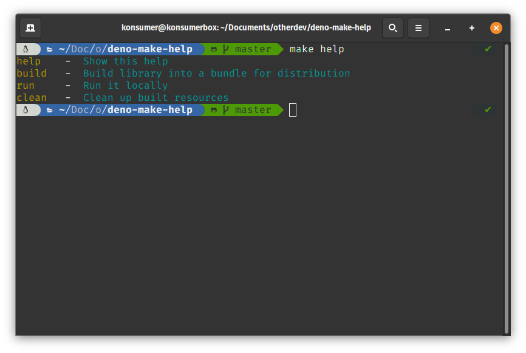

# deno-make-help

This will allow you to make nice help for your deno makefiles, to document your project. It has no dependencies, other than deno, and no permissions or extra files are needed.


## usage

Make a `Makefile` in your project that sort of looks like this:

```Makefile
.PHONY: help build run clean

#: Show this help
help:
	@cat $(MAKEFILE_LIST) | deno run -q https://raw.githubusercontent.com/konsumer/deno-make-help/master/help.ts

#: Build library into a bundle for distribution
build: bundle.ts

#: Run it locally
run:
	deno run -A --unstable main.ts

#: Clean up built resources
clean:
	rm -f bundle.ts

# this comment won't show in help
bundle.ts: main.ts
	deno bundle --unstable  main.ts > bundle.ts
```

Which makes help like this:




Since `help` is the first target, when a user calls `make` or `make help` they will get a nice help. You can comment your targets by starting a line with `#: ` above a target, as I have done above, with `help`